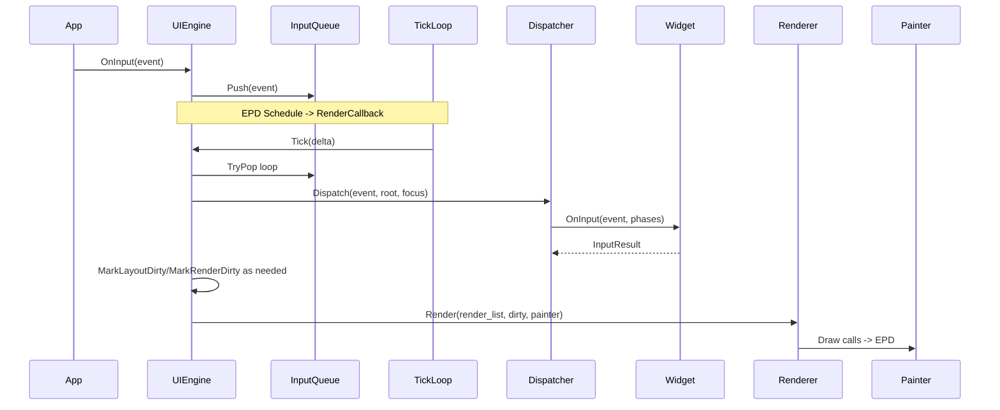

# app_ui 模块说明文档

本文档汇总并说明 `app_ui` 子系统的架构、工作原理、模块划分、接口、数据结构、调用关系、时序/流程图和使用示例。

**快速索引**
- **架构总览**
- **模块说明**（`Widget` / `WidgetBuilder` / `Scene` / `UIEngine` / `Input` / `Renderer` / `StatusBar` / ` types` / `desc`）
- **时序图 / 流程图（Mermaid）**
- **核心数据结构与类型**
- **所有对外接口与使用方法**
- **示例：构建与运行一个场景**

**目标读者**：需要理解或扩展 UI 框架（添加控件、定制渲染、调试交互）的开发者。

## 架构总览

高层架构要点：
- `UIEngine`：编排器（orchestrator），负责事件排队、调度布局与渲染、根树切换与 EPD 调度。
- `Scene/SceneRuntime`：负责从静态描述符（`desc::UiDesc`）或资源表构建 `Widget` 树。
- `Widget`：UI 的基础单位，支持层次结构、测量/布局/绘制与输入处理。
- `Renderer` + `Painter`：将 `Widget` 的 `Draw()` 请求转换为具体绘制（EPD/Adafruit_GFX）。
- `InputQueue` / `InputDispatcher` / `FocusManager`：处理输入事件（按键/触摸），决议目标控件并执行捕获-目标-冒泡流程。

整体交互（简述）：
1. 应用或路由器加载 `UiDesc` → `SceneRuntime::LoadFromDesc()` 构建 `Widget` 树。
2. 将树交给 `UIEngine::SetRoot()`，引擎标记布局/渲染为脏并安排 EPD 调度。
3. EPD 调度回调中执行 `UIEngine::Tick()`：执行布局（LayoutEngine）、构建渲染列表（RenderList）、处理输入队列并调用 `Renderer::Render()`。
4. 输入由 `UIEngine::OnInput()` 入队；`Tick()` 时通过 `InputDispatcher` 分发到 `Widget::OnInput()`。

## 模块说明（细节）

**1. types.h（核心类型）**
- 基础几何与资源类型：`Size`, `Point`, `Rect`。
- 枚举：`WidgetType`, `PropertyKey`, `Anchor`, `Gravity`, `InputResult` 等。
- 生成器/资源描述结构：`GeneratedMeta`, `GeneratedTextResource`, `GeneratedStyle` 等。

用途：供框架内部与静态描述符互通，构建器与渲染器使用这些类型来布局与显示。

**2. widget.h / widget.cc（Widget 层次与 API）**
- 抽象类 `Widget`：声明并实现通用行为——子节点管理、测量/布局缓存（LayoutCache）、可见/启用/聚焦标志、脏标记（DirtyBits）、ID 查找。
- 常用派生：`BasicWidget`, `ContainerWidget`, `TextWidget`, `LabelWidget`, `ButtonWidget`, `ImageWidget`, `ListViewWidget`, `TabViewWidget`, `SoftKeyboardWidget` 等。
- 重要方法：
	- `Measure(const Size&)` / `Layout(const Rect&)` / `Draw(Painter&)` / `OnInput()`（可覆写）
	- 标志操作：`SetVisible`, `SetEnabled`, `SetFocusable`, `SetFocused`。
	- 脏管理：`MarkDirty`, `MarkLayoutDirty`, `MarkMeasureDirty`。

实现要点：
- `Measure`/`Layout` 使用 `LayoutCache` 缓存测量结果并维护版本号。
- `Draw(Painter, dirty)` 支持局部绘制（`local_dirty`）。
- `FindById()` 递归查找；`AddChild()` 会把 child 绑定到 engine 并触发布局脏。

**3. widget_builder.h / widget_builder.cc（静态描述符构建器）**
- 提供两个重载：
	- `BuildWidgetTree(const resource::WidgetInit* inits, size, root_id)`（轻量资源表）
	- `BuildWidgetTree(const desc::WidgetDesc* widgets, size, root_id)`（完整描述符）
- 根据 `WidgetType` 创建对应 `Widget` 实例，并应用通用/特定字段（文本、可选、进度等）。

**4. scene.h / scene.cc（场景加载与运行时）**
- `Scene` 抽象：每个场景负责创建其 UI（`BuildUI()`），並可响应 `OnEnter/OnExit`。
- `runtime::SceneRuntime::LoadFromDesc()`：从 `desc::UiDesc` 查找场景并调用 `BuildWidgetTree` 构建根树；会合并 `public_scene`（如果存在）到容器中。

**5. ui_engine.h / ui_engine.cc（UI 引擎）**
- 公开接口（常用）：
	- `void OnInput(const InputEvent& e)`：接收外部输入，非阻塞地入队或被延迟。
	- `void SetRoot(std::unique_ptr<Widget> root)`、`Reset()`、`SetEpd(CustomEpdDisplay*)`、`SetPainter(Painter*)`、`SetViewport(const Rect&)`。
	- `void Tick(uint32_t delta_ms)`：执行布局、输入分发、渲染；由 EPD 调度回调触发。
- 内部组件：`LayoutEngine layout_`, `RenderList render_list_`, `DirtyTracker dirty_`, `Renderer renderer_`, `StyleManager`, `AnimationEngine`, `InputQueue input_queue_`, `InputDispatcher dispatcher_`, `FocusManager focus_`。
- 调度行为：设置 `need_layout_/need_render_` 标志并使用 `EpdManager::Schedule()` 安排 `RenderCallback`。

**6. input.h / input.cc（输入子系统）**
- 类型：`InputType`, `KeyCode`, `InputEvent`（包含 `type/key/pos/timestamp`）。
- `InputQueue`：线程安全的入队/出队。
- `FocusManager`：遍历 `Widget` 树收集 focusable id 列表；支持空间移动与线性移动、wrap 设置、SetCurrentById()。
- `InputDispatcher`：构建路径（针对 pointer 使用命中测试），并以捕获→目标→冒泡顺序调用 `Widget::OnInput(event, phase)`。

**7. renderer.h / renderer.cc（渲染）**
- `Painter` 抽象，`EpdPainter` 实现 Adafruit_GFX + CustomEpdDisplay 的绘制桥接。
- `DirtyTracker`：收集多个脏区，并能决定是否需要全刷新。
- `LayoutEngine`：按 `Widget::LayoutMode` 递归测量与布局子节点。
- `RenderList`：从 `Widget` 树遍历并按 (depth, z, order) 排序生成绘制对象列表。
- `Renderer::Render()`：遍历 `RenderList`，在 `Painter` 上调用 `widget->Draw(painter, local_dirty)` 并在结束后 `dirty.Clear()`。

**8. status_bar.h/cc（状态栏工具函数）**
- 提供顶部/底部栏绘制的便捷 API（使用板级 `Board` 查询电量、音量等），并包含资源加载（`LoadBinImage`）与时间格式化辅助函数。

## 时序图（关键流程）

以下 Mermaid 时序图展示了常见事件流（按键输入到渲染）:



流程图（场景加载与渲染循环）：

```mermaid
flowchart TD
	A[Load UiDesc] --> B[SceneRuntime::LoadFromDesc]
	B --> C[BuildWidgetTree]
	C --> D[UIEngine::SetRoot]
	D --> E[EPD Schedule(RenderCallback)]
	E --> F[UIEngine::Tick]
	F --> G[LayoutEngine::LayoutTree]
	G --> H[RenderList::Build]
	H --> I[Renderer::Render]
	I --> J[Painter -> EPD]
```

## 函数调用关系摘要（关键点）
- 应用层 -> `SceneRuntime::LoadFromDesc()` -> `BuildWidgetTree()` -> `Widget` 实例化
- 应用层 -> `UIEngine::SetRoot()` -> `UIEngine::Tick()` 调度布局與渲染
- 外部輸入 -> `UIEngine::OnInput()` -> `InputQueue::Push()` -> `Tick()` 时 `InputDispatcher::Dispatch()` -> `Widget::OnInput()`（Capture/Target/Bubble）
- `Widget` 在逻辑变化时调用 `MarkDirty()` / `MarkLayoutDirty()` -> `UIEngine` 收到 `AddDirty()` 并 `ScheduleIfNeeded()`
- `Renderer::Render()` 对每个 `RenderObject` 调用 `widget->Draw(painter, local_dirty)`

## 数据接口、结构与类型（摘录与说明）

- `InputEvent` (from `input.h`):
	- fields: `InputType type`, `int key`, `Point pos`, `uint32_t timestamp`
	- 用法：按键或指针事件封装成此结构后通过 `UIEngine::OnInput()` 传入。

- `desc::UiDesc` / `desc::SceneDesc` / `desc::WidgetDesc` (from `ui_desc.h`)：
	- 生产路径（静态描述符），由 UI 生成器导出。
	- `SceneDesc` 包含 `widgets`, `widget_count`, `root_id`。
	- `WidgetDesc` 包含 `id`, `parent_id`, `type`, `rect`, `style_id`, `flags`, `specific` 指针。

- `resource::UIResource` / `resource::WidgetInit`（轻量资源表）：
	- 运行时可选择使用轻量 `WidgetInit` 表而非完整 `desc`。

- `Widget` 内部 cache（`LayoutCache`）：保存测量/布局结果与版本号，避免重复计算。

## 所有对外接口（API 汇总与用法）

主要面向应用或上层框架调用的函数：

- UI 引擎（`UIEngine`）
	- `void OnInput(const InputEvent& e)`：注入输入事件。
	- `void SetRoot(std::unique_ptr<Widget> root)`：设置新根 UI 树（会在下一次 Tick 交换）。
	- `void SetEpd(CustomEpdDisplay* epd)`：绑定 EPD，设置 viewport，并触发布局。
	- `void SetPainter(Painter* painter)`：引擎内用于临时设置绘制器（通常由 RenderCallback 设置）。
	- `void Tick(uint32_t delta_ms)`：驱动一次布局/渲染/输入处理；通常在 EPD 回调中被调用。

- 场景/构建
	- `SceneRuntime::LoadFromDesc(const desc::UiDesc& ui, const char* scene_id, uint16_t scene_index)`：从静态描述构建场景 root。
	- `BuildWidgetTree(const desc::WidgetDesc* widgets, size_t count, uint32_t root_id)`：从 `WidgetDesc` 表构建树。

- 输入
	- `InputQueue::Push() / TryPop()`：线程安全队列。
	- `FocusManager::SetCurrentById(uint32_t id)`：请求将指定控件设为聚焦。

- 渲染
	- `Renderer::Render(RenderList& list, DirtyTracker& dirty, Painter& painter)`：执行渲染流程（内部使用 `widget->Draw()`）。

## 使用示例（代码片段）

静态描述符加载并显示场景的典型流程：

```cpp
// 1) 通过编译期生成的 desc::UiDesc 获取场景列表
desc::UiDesc my_ui = /* 引入生成的 UiDesc */;

// 2) 使用 SceneRuntime 加载场景
app_ui::runtime::SceneRuntime runtime;
if (!runtime.LoadFromDesc(my_ui, "main_scene", 0)) {
		// 处理错误
}

// 3) 拿到根并交给 UIEngine
std::unique_ptr<app_ui::Widget> root = runtime.TakeRoot();
ui_engine.SetRoot(std::move(root));

// 4) 绑定 EPD（初始化时）
ui_engine.SetEpd(custom_epd_ptr);

// 5) 注入输入（例如按键）
app_ui::InputEvent e;
e.type = app_ui::InputType::KeyDown;
e.key = static_cast<int>(app_ui::KeyCode::Down);
ui_engine.OnInput(e);

// 6) EPD 调度中会调用 RenderCallback -> UIEngine::Tick()
```

如何在运行时由代码创建 widget 树（简单示例）：

```cpp
using namespace app_ui;
auto root = std::make_unique<ContainerWidget>();
root->SetId(1);
root->SetRectInParent({0,0,200,200});

auto label = std::make_unique<LabelWidget>();
label->SetId(2);
label->SetText("Hello");
label->SetRectInParent({10,10,100,20});
root->AddChild(std::move(label));

ui_engine.SetRoot(std::move(root));
```

## 扩展与调试建议

- 添加自定义控件：继承 `Widget` 或 `BasicWidget`，实现 `OnMeasure`/`OnDraw`/必要的 `OnInput`。将类型加入 `WidgetType` 与 `CreateWidgetByType()`。
- 性能优化：当前 `UIEngine::Tick()` 在 Render 阶段强制将整个 viewport 标记为脏（以保证完整性），可以通过调整 `DirtyTracker` 与 `Renderer` 来支持更精细的脏区刷新。
- 日志：`debug.h` 中的函数可用于输出场景切换/绘制项/聚焦切换等调试信息。

## 细节注意事项

- 线程和调度：`UIEngine` 使用 `std::recursive_mutex` 保护其状态，并通过 `EpdManager::Schedule()` 安排 `RenderCallback`。避免在非线程安全上下文直接修改 UI 树。
- 聚焦语义：`FocusManager` 支持空间搜索（`MoveSpatial`）与线性移动（`MoveLinear`）；控件可以通过 `OnFocusKey()` 返回 `FocusIntent` 来改变默认行为。
- 构建路径：生产环境优先使用 `desc::UiDesc`（更丰富），资源受限场景可使用 `resource::WidgetInit` 轻量表。

---

如果你希望我将此 README 中的 Mermaid 图渲染为 PNG/SVG 并放入仓库，或者希望我把 README 翻译成英文版本，或为每个 Widget 类生成单独 API 文档，请告诉我下一个要做的步骤。

