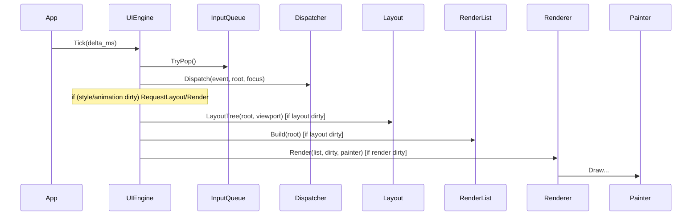
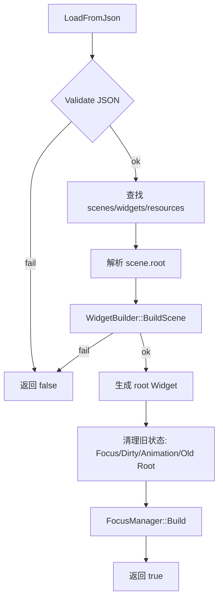

app_ui 文档

概览
- 目标：提供轻量 UI 运行时（布局、渲染、输入、焦点、样式、动画），支持从 JSON 动态构建场景。
- 核心入口：`UIEngine`（见 [main/eteacher/app_ui/ui_engine.h](main/eteacher/app_ui/ui_engine.h) 与 [main/eteacher/app_ui/ui_engine.cc](main/eteacher/app_ui/ui_engine.cc)）。
- 数据驱动：`runtime::SceneManager::LoadFromJson` 通过 JSON 构建 `Widget` 树（见 [main/eteacher/app_ui/scene.cc](main/eteacher/app_ui/scene.cc)）。

UI 架构
1) 数据层
	- JSON UI 描述（场景、控件、资源）。
	- 结构验证：`UiSchemaValidator`（见 [main/eteacher/app_ui/scene.cc](main/eteacher/app_ui/scene.cc)）。
2) 运行时层
	- 场景栈：`SceneManager`（静态场景）与 `runtime::SceneManager`（JSON 场景）。
	- 互斥规则：同一时刻 UIEngine 只能有一个 Active Root（静态 Scene 或 JSON Scene 之一）。
	  切换 Root 时必须清理状态：清空焦点、清空脏区、停止动画、释放旧 Root。
	- 控件树：`Widget` 基类 + `BasicWidget`/具体控件。
3) 系统层
	- 输入：`InputQueue` + `InputDispatcher` + `FocusManager`。
	- 布局：`LayoutEngine`。
	- 渲染：`RenderList` + `Renderer` + `Painter`。
	- 脏矩形：`DirtyTracker`。
	- 动画与样式：`AnimationEngine`、`StyleManager`。

工作原理
1) App 进入时构建/加载场景（静态 Scene 或 JSON）。
2) `UIEngine::Tick`（条件驱动）：
	- 处理输入事件 → 分发到控件树。
	- 若样式/动画脏：触发布局或渲染请求。
	- 若布局脏：测量/布局，并构建渲染列表。
	- 若渲染脏：执行增量或全量绘制。

所有模块设计（文件与职责）
- `UIEngine`（含 Style/Animation）：主循环与协同调度。[main/eteacher/app_ui/ui_engine.h](main/eteacher/app_ui/ui_engine.h)
- `Scene`/`SceneManager` + `runtime::SceneManager` + `UiSchemaValidator`：[main/eteacher/app_ui/scene.h](main/eteacher/app_ui/scene.h)
- `Widget`/`BasicWidget`/控件集：[main/eteacher/app_ui/widget.h](main/eteacher/app_ui/widget.h)
- `WidgetBuilder`：JSON → 控件树。[main/eteacher/app_ui/widget_builder.h](main/eteacher/app_ui/widget_builder.h)
- `Renderer`/`RenderList` + `LayoutEngine` + `DirtyTracker` + `Painter`：[main/eteacher/app_ui/renderer.h](main/eteacher/app_ui/renderer.h)
- `InputQueue`/`InputDispatcher` + `FocusManager`：[main/eteacher/app_ui/input.h](main/eteacher/app_ui/input.h)
- 基础数据结构与资源描述：`Size/Point/Rect`、`WidgetType` 等。[main/eteacher/app_ui/types.h](main/eteacher/app_ui/types.h)

时序图（UIEngine::Tick）


流程图（JSON 场景加载）


函数调用关系（核心链路）
- `UIEngine::Tick` → `InputQueue::TryPop` → `InputDispatcher::Dispatch` → `Widget::OnInput`
- `UIEngine::Tick` → `LayoutEngine::LayoutTree` → `Widget::Measure` → `Widget::Layout`
- `UIEngine::Tick` → `RenderList::Build` → `Renderer::Render` → `Widget::Draw`
- `runtime::SceneManager::LoadFromJson` → `UiSchemaValidator::Validate` → `WidgetBuilder::BuildScene`

依赖规则（必须遵守）
- Widget 不得直接访问 `UIEngine` 或 `SceneManager`。
- Widget 只能通过 `MarkDirty()` / `MarkLayoutDirty()` 或回调/事件上报请求刷新。

数据接口
JSON 结构（要求至少包含以下字段）：
- `scenes`：对象，key 为场景 id，value 包含 `root`。
- `widgets`：对象，key 为控件 id，value 包含 `type` 与 `rect`。
- `resources.texts`：可选，用于 `textId` 解析。
- `rect`：包含 `x/y/w/h`，均为数值。
- `children`：可选，数组，容器类控件才允许有子节点。

演进建议（预留字段）
- `meta.ui_version`：版本号。
- `layout`：预留布局模型字段，例如：
	- `layout.type = "absolute"`
	- `layout.rect = {x,y,w,h}`

数据结构与数据类型
- `Size`/`Point`/`Rect`：[main/eteacher/app_ui/types.h](main/eteacher/app_ui/types.h)
- `InputEvent`/`InputType`：[main/eteacher/app_ui/input.h](main/eteacher/app_ui/input.h)
- `WidgetType`、`SceneID` 等枚举：[main/eteacher/app_ui/types.h](main/eteacher/app_ui/types.h)
- `WidgetFlags`/`LayoutCache`：[main/eteacher/app_ui/widget.h](main/eteacher/app_ui/widget.h)

状态与生命周期约束
- `WidgetFlags` 仅允许由 Widget 自身与核心引擎修改；外部模块不得随意改写。
- `RectInParent/Window/Screen` 的更新由 Layout 阶段统一完成，Widget 不应私自修改。
- `InputEvent` 为值语义，禁止跨 Tick 保存指针/引用。

所有接口（Public API 摘要）
UI 引擎
- `UIEngine`: `OnInput()`, `RequestLayout()`, `RequestRender()`, `Tick()`, `SetPainter()`, `SetViewport()`, `Scenes()`, `Input()`。

场景
- `Scene`: `BuildUI()`, `Name()`, `OnEnter()`, `OnExit()`, `OnPause()`, `OnResume()`, `Root()`。
- `SceneManager`: `Push()`, `Pop()`, `Replace()`, `FindByName()`, `Current()`, `Clear()`, `PromoteToTop()`。
- `runtime::SceneManager`: `LoadFromJson()`, `Root()`, `Focus()`, `SceneId()`。

控件与构建
- `Widget`: `AddChild()`, `Parent()`, `Children()`, `Measure()`, `Layout()`, `Draw()`, `OnInput()`, `OnAttach()`, `OnDetach()`, `MarkDirty()`, `MarkLayoutDirty()`, `SetVisible()`, `Visible()`, `SetEnabled()`, `Enabled()`, `SetFocusable()`, `RectInParent()`, `RectInWindow()`, `RectInScreen()`, `MapToGlobal()`, `MapFromGlobal()`, `HitTest()`, `Focusable()`, `ZOrder()`, `SetRectInParent()`。
- `WidgetBuilder`: `BuildWidget()`, `BuildScene()`。

布局与渲染
- `LayoutEngine`: `LayoutTree()`。
- `RenderList`: `Clear()`, `Build()`, `Items()`。
- `Renderer`: `Capabilities()`, `Render()`。
- `Painter`: `SetClip()`, `PushClip()`, `PopClip()`, `DrawText()`, `MeasureText()`, `DrawRect()`, `FillRect()`, `DrawImage()`, `SetFont()`, `SetDrawColor()`, `SetTextColor()`, `DrawCircle()`, `SetTransform()`, `SetAlpha()`。

输入与焦点
- `InputQueue`: `Push()`, `TryPop()`, `Clear()`, `Size()`。
- `InputDispatcher`: `Dispatch()`。
- `FocusManager`: `Build()`, `MoveUp()`, `MoveDown()`, `MoveLeft()`, `MoveRight()`, `Current()`, `SetWrap()`。

辅助模块
- `DirtyTracker`: `Add()`, `HasDirty()`, `Merge()`, `RequireFullRefresh()`, `Clear()`。
- `StyleManager`: `MarkDirty()`, `ConsumeLayoutDirty()`, `ConsumeRenderDirty()`。
- `AnimationEngine`: `Tick()`, `StopAll()`。

使用方法
1) 构建静态场景
	- 继承 `Scene`，实现 `BuildUI()`，并将场景 Push 到 `SceneManager`。
2) 使用 JSON 场景
	- 通过 `runtime::SceneManager::LoadFromJson()` 读取 JSON 结构并生成控件树。
3) 运行
	- 将 `Painter` 绑定给 `UIEngine`，设置 viewport。
	- 周期性调用 `UIEngine::Tick(delta_ms)`。

使用约束
- 所有 UI API 仅允许在 UI 线程调用。
- Scene 切换必须遵守“清理旧状态”顺序（Focus/Dirty/Animation/Old Root）。

文件精简结果
- 核心文件（建议关注）
	- [main/eteacher/app_ui/ui_engine.h](main/eteacher/app_ui/ui_engine.h)
	- [main/eteacher/app_ui/ui_engine.cc](main/eteacher/app_ui/ui_engine.cc)
	- [main/eteacher/app_ui/scene.h](main/eteacher/app_ui/scene.h)
	- [main/eteacher/app_ui/scene.cc](main/eteacher/app_ui/scene.cc)
	- [main/eteacher/app_ui/widget.h](main/eteacher/app_ui/widget.h)
	- [main/eteacher/app_ui/widget.cc](main/eteacher/app_ui/widget.cc)
	- [main/eteacher/app_ui/widget_builder.h](main/eteacher/app_ui/widget_builder.h)
	- [main/eteacher/app_ui/widget_builder.cc](main/eteacher/app_ui/widget_builder.cc)
	- [main/eteacher/app_ui/renderer.h](main/eteacher/app_ui/renderer.h)
	- [main/eteacher/app_ui/renderer.cc](main/eteacher/app_ui/renderer.cc)
	- [main/eteacher/app_ui/input.h](main/eteacher/app_ui/input.h)
	- [main/eteacher/app_ui/input.cc](main/eteacher/app_ui/input.cc)
	- [main/eteacher/app_ui/types.h](main/eteacher/app_ui/types.h)
	- [main/eteacher/app_ui/status_bar.h](main/eteacher/app_ui/status_bar.h)
	- [main/eteacher/app_ui/status_bar.cc](main/eteacher/app_ui/status_bar.cc)
- 兼容层已删除

示例
JSON 片段（结构示意）：
```json
{
  "scenes": { "main_scene": { "root": "root_main" } },
  "widgets": {
	 "root_main": { "type": "Container", "rect": {"x":0,"y":0,"w":400,"h":300}, "children": ["label_1"] },
	 "label_1": { "type": "Label", "rect": {"x":10,"y":10,"w":100,"h":30}, "properties": {"text":"Hello"} }
  }
}
```

调用示例（伪代码）：
```cpp
app_ui::UIEngine engine;
engine.SetPainter(painter);
engine.SetViewport({0,0,400,300});
engine.Scenes().Push(std::make_unique<MyScene>());
engine.Tick(16);
```

WidgetBuilder 事务语义
- `BuildScene()` 要么返回完整、可用的 Root Widget；要么返回 `nullptr`，系统状态不变。
- Builder 内部不得直接触碰 `UIEngine`/`FocusManager`。

Style/Animation 作用域
- Style/Animation 视为 Root 级状态，Scene 切换时必须 Reset。
