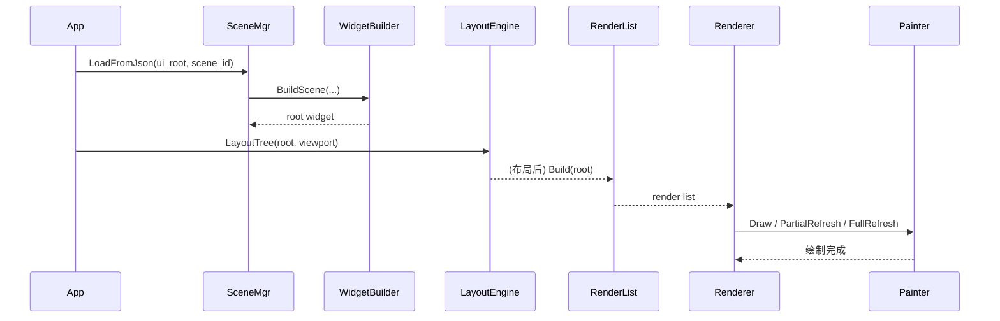
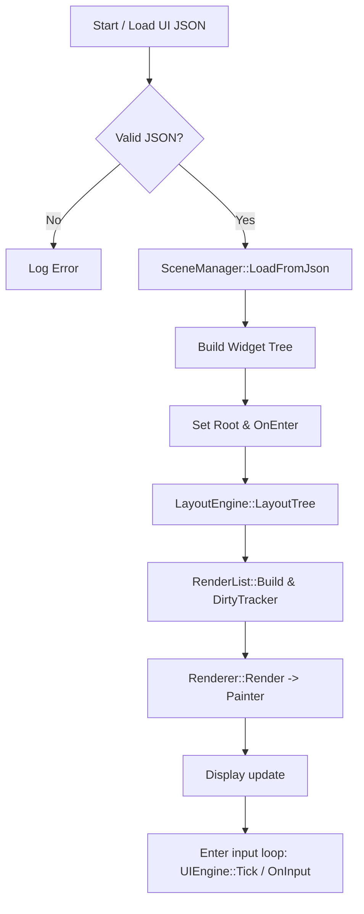

**Overview**
- **描述**: 本目录实现了轻量级的嵌入式 UI 框架（用于 EPD 等显示屏），负责从 JSON 或资源描述构建 Widget 树、布局计算、绘制以及输入分发。

**UI 架构**
- **分层**: Scene / Widget 构建层 -> LayoutEngine（布局）-> RenderList（渲染对象表）-> Renderer（渲染器）-> Painter（具体绘制后端，如 `EpdPainter`）。
- **职责划分**:
	- **Scene/SceneManager**: 管理页面（场景）生命周期与根 Widget。见 [main/eteacher/app_ui/scene.h](main/eteacher/app_ui/scene.h#L1-L200)。
	- **Widget / Widget 子类**: 表示 UI 元素（Label、Button、ListView 等），实现测量/布局/绘制接口。见 [main/eteacher/app_ui/widget.h](main/eteacher/app_ui/widget.h#L1-L200)。
	- **WidgetBuilder / UI JSON Loader**: 从 JSON 或资源构建 Widget 树。见 [main/eteacher/app_ui/widget_builder.cc](main/eteacher/app_ui/widget_builder.cc#L1-L200) 和 [main/eteacher/app_ui/ui_json_loader.cc](main/eteacher/app_ui/ui_json_loader.cc#L1-L200)。
	- **LayoutEngine**: 递归计算每个 Widget 的大小与位置，见 [main/eteacher/app_ui/renderer.h](main/eteacher/app_ui/renderer.h#L1-L200)（包含 `LayoutEngine` 声明）。
	- **RenderList / DirtyTracker**: 将可见 Widget 展开成 RenderObject 列表，并记录需要刷新的区域/原因。
	- **Renderer / Painter**: `Renderer` 负责根据 `RenderList` 与 `DirtyTracker` 调用 `Painter`（如 `EpdPainter`）完成具体绘制操作。接口位于 [main/eteacher/app_ui/renderer.h](main/eteacher/app_ui/renderer.h#L1-L200)。
	- **UIEngine**: 协调输入、布局、渲染、样式与动画的高层控制器，见 [main/eteacher/app_ui/ui_engine.h](main/eteacher/app_ui/ui_engine.h#L1-L200)。

**工作原理（高层步骤）**
- 启动/进入场景: 通过 `LoadUiJson()` 载入 UI JSON（或从编译时嵌入数据）；使用 `WidgetBuilder` / `SceneManager` 构造 Widget 根树。
- 布局: 根 Widget 设置 viewport，调用 `LayoutEngine::LayoutTree(root, viewport)` 计算所有子节点布局。
- 构建渲染列表: `RenderList::Build(root)` 将树转换为按 z/深度/顺序的 `RenderObject` 列表。
- 计算脏区域: `DirtyTracker` 收集需要刷新的矩形（Full/Visual/Layout）。
- 渲染: `Renderer::Render(list, dirty, painter)` 使用 `Painter`（例如 `EpdPainter`）逐项绘制或触发整屏刷新。
- 输入分发: `UIEngine::OnInput()` 将事件放入 `InputQueue`，由 `InputDispatcher` / `FocusManager` 将事件派发到合适的 `Widget::OnInput()`。

注意（2026-02-07 更新）
- UI 调度职责已收口到 `UIEngine`：EPD 调度（`EpdManager::Schedule`）、Painter 生命周期以及何时真正触发局部/整屏刷新都由 `UIEngine` 决定。App 层不应直接调用 `EpdManager::Schedule` 或创建 `EpdPainter`。
- 新增接口：
	- `UIEngine::SetEpd(::CustomEpdDisplay*)` — 将底层显示驱动传入引擎（引擎负责后续调度与 viewport 设置）。
	- `UIEngine::SetRoot(std::shared_ptr<Widget>)` — 覆盖当前渲染根（可用于把 runtime 场景 root 传入引擎）。
	- `UIEngine::Reset()` — 重置内部状态并取消任何挂起调度。
	- 保留：`RequestRender() / RequestLayout()` — App 请求渲染，但不负责实际调度细节。

**并发与稳定性改进**
- `UIEngine` 内部现在管理 EPD 任务调度（调用 `EpdManager::Schedule`）并在 EPD 任务回调内构建 `EpdPainter`，然後调用 `Tick()` 执行布局与渲染流程。这样可以：
	- 合并多个 `RequestRender()` 请求；
	- 在引擎内部决定是否做 partial refresh 或 full refresh（通过 `DirtyTracker` 与 `RenderCapabilities`）；
	- 隐藏平台相关的绘制细节（便于将来替换非 EPD 的显示后端）。

- 为避免 App 与 EPD 任务并发修改内部状态出现悬空指针或崩溃，`UIEngine` 增加了内部互斥保护（`std::recursive_mutex`）并在关键方法（`SetRoot`/`SetEpd`/`Reset`/`SetViewport`/`Tick`）中加锁，保证渲染过程中 root 与 RenderList 不会被并发替换。

**已修复的已知问题（说明与建议）**
- 问题：App 在调用 `SetRoot()` / 立刻 `EpdManager::Schedule()` 时，EPD 任务可能正遍历旧树导致悬空 `Widget*`，在 `widget->Draw()` 处触发非法指令（InstrFetchProhibited）重启。修复：将调度收回到 `UIEngine` 并加锁。
- 问题：无根（root==nullptr）时仍保留 `need_render_` 会导致无限局刷。修复：在 `Tick()` 内检测 `root==nullptr` 时清理 `dirty_`/`need_layout_`/`need_render_`，避免无根循环刷屏。

**App 使用示例（更新后推荐用法）**
推荐 App 的渲染调用仅包含三步：

```cpp
// 只在 OnEnter 或初始化时设置一次
ui_engine_.SetEpd(epd);

// 当选择/加载场景后，把场景 root 传入引擎（使用 shared_ptr）
ui_engine_.SetRoot(scene_mgr_.RootShared());

// 请求渲染（非阻塞）
ui_engine_.RequestRender();
```

不要在 App 中直接调用 `EpdManager::Schedule`、创建 `EpdPainter`、或在 App 线程调用 `Tick()`；这些都已被封装在 `UIEngine` 内部。

**实现细节（快捷说明）**
- `UIEngine` 在接到 `RequestRender()` 时会：
	1. 标记需要布局/渲染並调用 `ScheduleIfNeeded()`；
	2. `ScheduleIfNeeded()` 在尚未调度時调用 `EpdManager::Schedule(RenderCallback, this)`；
	3. `RenderCallback` 在 EPD 任务上下文中建立 `EpdPainter` 並调用 `RenderInternal(gfx)`，`RenderInternal` 会内部调用 `Tick()` 来执行布局/渲染流程；
	4. 渲染完成后，若 `need_render_` 仍为 true，会再次 `ScheduleIfNeeded()`（用于合并/连续帧需求）。

- `UIEngine` 使用互斥保护（`std::recursive_mutex mutex_`）来同步 `SetRoot`/`Reset`/`SetEpd` 与渲染路径，並在 `Tick()` 检查 `root==nullptr` 时清理 `dirty_`/`need_layout_`/`need_render_`，避免无根循环刷屏。

**调试建议**
- 日志级别：保留 `printf` / `SetChatMessage` 仅用于错误与重要状态，避免大量日志导致 RTOS 调度退化。
- 如果出现刷新频繁或崩溃，检查：
	- App 是否频繁调用 `SetRoot` 或在 LoadFromJson 失败时仍调用 `RequestRender()`；
	- EPD 任务是否被多次重复调度（`scheduled_` 标志应避免重复）；
	- 是否有长时间阻塞的 Widget 绘制或文本测量（可能阻塞 EPD 任务）。

**接下来的改进建议（可选）**
- 引擎层面把 `RenderList` 采用“快照”或双缓冲策略：在渲染任务开始前复制出当前 `RenderList` 快照，渲染使用快照，从而完全避免在渲染期间对树做修改导致的问题（现有锁已经能解决大多数竞态，但快照更稳）。
- 将 `SetScene(std::unique_ptr<Scene>)` 的 API 添加到 `UIEngine`，让 `SceneManager` 与 App 无需直接操作 `RootShared()`。


**模块设计（逐项说明）**
- **Scene / SceneManager**: 管理场景栈（Push/Pop/Replace）、加载 JSON 到运行时 `SceneRuntime`（参考 `runtime::SceneManager::LoadFromJson`），并暴露 `Root()` 用以渲染。
- **Widget (核心类型)**: `Widget` 提供：测量 `Measure()`、布局 `Layout()`、绘制 `Draw()`、输入 `OnInput()`、脏/布局标记、坐标系映射方法（`MapToGlobal/MapFromGlobal`）。Widget 子类（Label、Button、ListView、Checkbox 等）在 `OnDraw()` 中实现自身绘制细节。
- **WidgetBuilder / UI JSON**: `WidgetBuilder::BuildScene()` / `BuildWidget()` 支持基于 cJSON 的 UI JSON 描述构建树，支持 properties/texts 解析与资源映射（文本解析、默认 focusable 规则等）。
- **LayoutEngine**: 递归测量并设置 `Widget::SetRectInParent()`，结果保存在 `LayoutCache`，支持缓存（measure/layout versioning）。
- **Render 系统**: `RenderList` 收集 `RenderObject`（包含 rect、widget 指针、z、depth、alpha、order），`DirtyTracker` 管理刷新策略，`Renderer` 判断是否能做局部刷新或必须全刷。
- **Painter / EpdPainter**: 抽象出绘制能力（clip、文字、矩形、图像、圆、变换、alpha），`EpdPainter` 将这些请求映射到底层显示驱动（`CustomEpdDisplay` + `Adafruit_GFX`）。

**时序图（Sequence Diagram）**


**流程图（Flow）**


**函数调用关系（关键）**
- `app_ui::LoadUiJson(name)` -> 解析嵌入的 JSON 字节（见 [main/eteacher/app_ui/ui_json_loader.cc](main/eteacher/app_ui/ui_json_loader.cc#L1-L200)）。
- `WidgetBuilder::BuildScene(scene_json, widgets_json, texts)` -> 递归调用 `BuildWidgetRecursive()` 生成 `Widget` 实例，并设置 `Rect/visible/enabled/focusable/text` 等属性（参见 [main/eteacher/app_ui/widget_builder.cc](main/eteacher/app_ui/widget_builder.cc#L1-L200)）。
- `SceneManager::runtime::SceneManager::LoadFromJson()` -> 将 JSON 加载到运行时结构并返回 `RootShared()`。
- 渲染路径: `LayoutEngine::LayoutTree(root, viewport)` -> `RenderList::Build(root)` -> `Renderer::Render(list, dirty, painter)` -> `Painter` 的各绘制方法（`DrawText/DrawRect/FillRect/DrawImage` 等）。

**数据接口 / 数据结构 / 数据类型**
- 关键类型集合定义在 [main/eteacher/app_ui/types.h](main/eteacher/app_ui/types.h#L1-L200)：
	- `Size`, `Point`, `Rect`：基础几何类型。
	- `WidgetType`, `SceneID`, `PropertyKey`, `Anchor`, `Gravity`：枚举类型。
	- `WidgetDesc`, `LayoutDesc`, `PropertyDesc`, `SceneDesc`, `LayoutPackage`：用于静态/生成 UI 资源的数据打包格式。
	- `resource::UIResource` / `resource::WidgetInit`：运行时资源/初始化结构。
	- `GeneratedEventBinding` / `GeneratedFocusEntry` / `GeneratedSceneFlowEntry`：生成的事件/焦点/场景流映射表。
- `RenderObject`（见 `renderer.h`）: 渲染阶段使用的中间结构（包含 `Rect rect; Widget* widget; uint8_t z; uint16_t depth; float alpha; uint32_t order;`）。

**公开接口一览（可直接调用 / 扩展点）**
- `cJSON* app_ui::LoadUiJson(const char* name)` — 载入嵌入的 UI JSON。
- `std::unique_ptr<Widget> WidgetBuilder::BuildScene(...)` / `BuildWidget(...)` — 从 JSON 构建 Widget。
- `scene::runtime::SceneManager::LoadFromJson(...)` — 将 JSON 场景加载到运行时并提供 `RootShared()`。见 [main/eteacher/apps/dictionary/dictionary.cc](main/eteacher/apps/dictionary/dictionary.cc#L1-L120) 的调用示例。
- `LayoutEngine::LayoutTree(Widget* root, const Rect& area)` — 执行布局。
- `RenderList::Build(Widget* root)` — 基于布局生成渲染对象列表。
- `Renderer::Render(RenderList& list, DirtyTracker& dirty, Painter& painter)` — 渲染入口。
- `Painter` 抽象：实现 `EpdPainter` 以适配目标显示驱动。
- `UIEngine`：更高层的协调器（`OnInput`, `RequestLayout`, `RequestRender`, `Tick` 等）。见 [main/eteacher/app_ui/ui_engine.h](main/eteacher/app_ui/ui_engine.h#L1-L200)。

**使用方法（最小示例，基于项目内 `DictionaryApp`）**
代码片段（摘自 `apps/dictionary/dictionary.cc`，简化版）:

```cpp
// 1. 载入 JSON（编译时嵌入或资源）
cJSON* ui_root = app_ui::LoadUiJson("dictionary");

// 2. 使用 runtime SceneManager 加载场景（按 id）
app_ui::runtime::SceneManager scene_mgr;
if (!scene_mgr.LoadFromJson(ui_root, "page1", 0)) {
		// 处理错误
}

// 3. 获取 shared root 并渲染（EPD 情况）
auto root_shared = scene_mgr.RootShared();
if (root_shared) {
		app_ui::LayoutEngine layout_engine;
		app_ui::Rect viewport{0,0,(int16_t)epd->width(),(int16_t)epd->height()};
		root_shared->SetRectInParent(viewport);
		layout_engine.LayoutTree(root_shared.get(), viewport);

		app_ui::RenderList list;
		list.Build(root_shared.get());

		app_ui::DirtyTracker dirty;
		dirty.Add(viewport, app_ui::DirtyReason::Full);

		app_ui::Renderer renderer;
		app_ui::EpdPainter painter(epd, gfx);
		renderer.Render(list, dirty, painter);
}
```

**示例说明**
- 代码演示了从嵌入 JSON 构建场景、执行布局、生成渲染列表并用 `EpdPainter` 绘制到 e-paper 显示的完整路径。

**函数/接口使用建议与注意事项**
- JSON 文件请确保为 UTF-8（`ui_json_loader.cc` 会尝试剥离 BOM 并拒绝 UTF-16）。
- 尽量使用 `RootShared()` 返回的 `shared_ptr` 在任务异步调度（如 `EpdManager::Schedule`）时保证生命周期安全。
- 布局与测量有缓存（`LayoutCache`），当属性变化时调用 `MarkLayoutDirty()` 或 `MarkDirty()` 来触发布局/重绘。
- `Renderer` 可能根据 `RenderCapabilities` 决定是否做 partial refresh；对 EPD 请确保 `DirtyTracker` 能正确合并区域以避免不必要的整屏刷新。

**扩展点**
- 添加新 Widget：继承 `Widget` 或 `BasicWidget`，实现 `OnMeasure` / `OnDraw`，并在 `widget_builder.cc` 的工厂中注册类型字符串。
- 添加新 Painter：实现 `Painter` 抽象并封装到 `Renderer` 的渲染流程中（例如支持灰度或反色）。

**参考代码位置**
- Widget 核心: [main/eteacher/app_ui/widget.h](main/eteacher/app_ui/widget.h#L1-L200)
- WidgetBuilder: [main/eteacher/app_ui/widget_builder.cc](main/eteacher/app_ui/widget_builder.cc#L1-L200)
- JSON Loader: [main/eteacher/app_ui/ui_json_loader.cc](main/eteacher/app_ui/ui_json_loader.cc#L1-L200)
- Renderer / Painter / Layout: [main/eteacher/app_ui/renderer.h](main/eteacher/app_ui/renderer.h#L1-L200)
- UI 协调器: [main/eteacher/app_ui/ui_engine.h](main/eteacher/app_ui/ui_engine.h#L1-L200)
- types 与资源描述: [main/eteacher/app_ui/types.h](main/eteacher/app_ui/types.h#L1-L200)
- 示例（Dictionary app）: [main/eteacher/apps/dictionary/dictionary.cc](main/eteacher/apps/dictionary/dictionary.cc#L1-L200)

如果需要，我可以：生成更完整的时序图（PNG/SVG）、把示例代码编译验证，或把 README 翻译成英文版。

